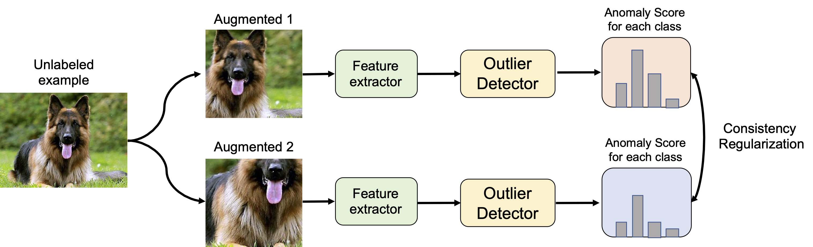

## [OpenMatch: Open-set Consistency Regularization for Semi-supervised Learning with Outliers (NeurIPS 2021)](https://arxiv.org/pdf/2105.14148.pdf)




This is an PyTorch implementation of OpenMatch.
This implementation is based on [Pytorch-FixMatch](https://github.com/kekmodel/FixMatch-pytorch).

## Requirement 
 use iomatch-requirement.txt

## Requirements(deprecated)
- python 3.6+
- torch 1.4
- torchvision 0.5
- tensorboard
- numpy
- tqdm
- sklearn
- apex (optional)


See [Pytorch-FixMatch](https://github.com/kekmodel/FixMatch-pytorch) for the details.

## Usage

### Dataset Preparation
This repository needs CIFAR10, CIFAR100, or ImageNet-30 to train a model.

To fully reproduce the results in evaluation, we also need SVHN, LSUN, ImageNet
for CIFAR10, 100, and LSUN, DTD, CUB, Flowers, Caltech_256, Stanford Dogs for ImageNet-30.
To prepare the datasets above, follow [CSI](https://github.com/alinlab/CSI).

跑cifar10数据集一定要先把 SVHN, LSUN, ImageNet，CIFAR10，100下载到data文件夹下，并且解压，并要把那些点开头的
图片文件删掉

```
mkdir data
ln -s path_to_each_dataset ./data/.   
#建立一个软链接，相当于起个别名，运行这个指令会让data文件夹下
#出现一个和数据集同名的文件，但是这个文件只是个链接。

## unzip filelist for imagenet_30 experiments.
unzip files.zip
```

All datasets are supposed to be under ./data.

### Train
Train the model by 50 labeled data per class of CIFAR-10 dataset:

```
sh run_cifar10.sh 50 save_directory
```

Train the model by 50 labeled data per class of CIFAR-100 dataset, 55 known classes:

```
sh run_cifar100.sh 50 10 save_directory
```


Train the model by 50 labeled data per class of CIFAR-100 dataset, 80 known classes:

```
sh run_cifar100.sh 50 15 save_directory
```


Run experiments on ImageNet-30:

```
sh run_imagenet.sh save_directory
```


### Evaluation
Evaluate a model trained on cifar10

```
sh run_eval_cifar10.sh trained_model.pth
```

### Trained models
Coming soon.

- [CIFAR10-50-labeled](https://drive.google.com/file/d/1oNWAR8jVlxQXH0TMql1P-c7_i5-taU2T/view?usp=sharing)
- [CIFAR100-50-labeled-55class](https://drive.google.com/file/d/1T5a_p4XUEOexEnjLWpGd-3pme4OzJ2pP/view?usp=sharing)
- ImageNet-30

### Acknowledgement
This repository depends a lot on [Pytorch-FixMatch](https://github.com/kekmodel/FixMatch-pytorch) for FixMatch implementation, and [CSI](https://github.com/alinlab/CSI) for anomaly detection evaluation.
 Thanks for sharing the great code bases!

### Reference
This repository is contributed by [Kuniaki Saito](http://cs-people.bu.edu/keisaito/).
If you consider using this code or its derivatives, please consider citing:

```
@article{saito2021openmatch,
  title={OpenMatch: Open-set Consistency Regularization for Semi-supervised Learning with Outliers},
  author={Saito, Kuniaki and Kim, Donghyun and Saenko, Kate},
  journal={arXiv preprint arXiv:2105.14148},
  year={2021}
}
```

